# Звіт з практичного проходження CTF "Death Note"

Цей документ містить покроковий опис виконання практичного завдання зі злому віртуальної машини. Процес поділено на етапи розвідки, отримання початкового доступу та підвищення привілеїв. 

## Етап 1: Розвідка та збір інформації

Робота розпочинається зі сканування цільової IP-адреси `192.168.122.35` за допомогою утиліти `nmap`. Зазвичай для сканування використовуються параметри, де `-Pn` вимикає перевірку доступності хоста через ping, а `-V` виводить розширену інформацію[cite: 1]. Сканування показало, що на машині відкриті два порти: 22 (сервіс SSH) та 80 (веб-сервер Apache). Робити спроби підбору паролів до SSH на цьому етапі немає сенсу, оскільки ми не маємо ані логіну, ані паролю[cite: 1].

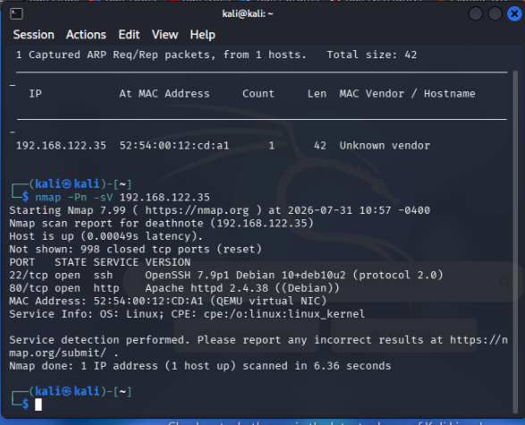

Оскільки відкритий 80 порт, наступним кроком є дослідження веб-ресурсу. Відкривши сайт у браузері, ми потрапляємо на сторінку, що базується на WordPress. Для глибшого розуміння структури сторінки використовуються інструменти розробника (Inspector) в браузері. У HTML-коді ми знаходимо шлях до фонового зображення логотипу, який вказує на директорію завантажень `/wordpress/wp-content/uploads/2021/07/`.

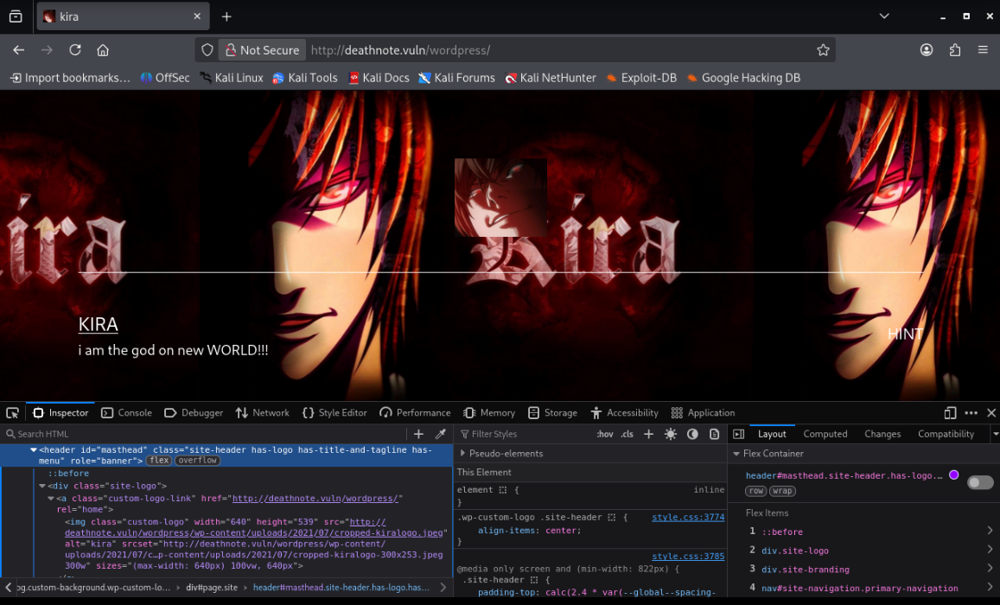

Перейшовши за цією адресою безпосередньо у браузері, ми виявляємо, що на сервері увімкнено відображення вмісту директорій (Directory Listing). Серед багатьох файлів зображень тут потенційно можуть знаходитися інші важливі файли, наприклад, текстові документи.

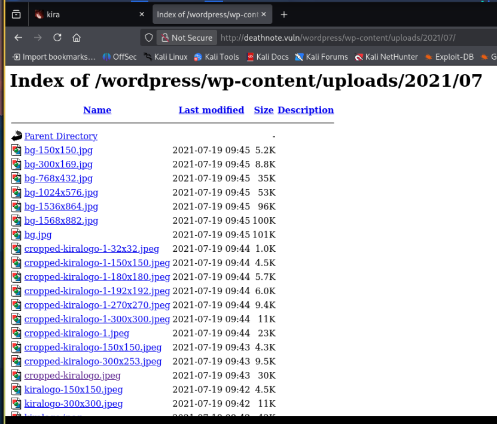

Паралельно з ручним дослідженням директорій, запускається автоматизоване сканування за допомогою утиліти `dirsearch`. Параметр `-u` вказує URL сайту, на якому потрібно провести підбір директорій та файлів[cite: 1]. Сканування виявляє декілька цікавих шляхів, зокрема сторінку входу `/wordpress/wp-login.php` та файл конфігурації пошукових систем `/robots.txt`.

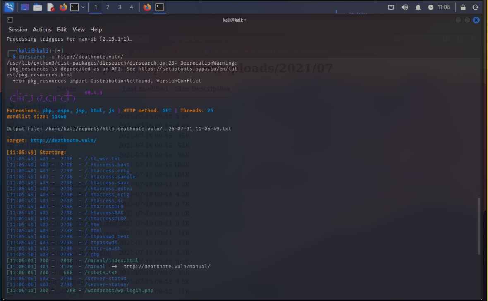

Перегляд вмісту `/robots.txt` дає нам підказку: автор залишив повідомлення про те, що додав підказку у файл `/important.jpg`, і просить його видалити.

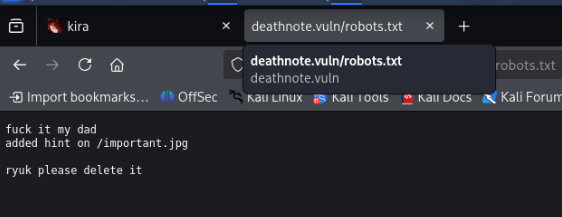

Замість того, щоб відкривати зображення в браузері, ми використовуємо утиліту `curl`, яка є інструментом для роботи з HTTP-запитами та дозволяє завантажити вміст за вказаним URL[cite: 1]. Виконання команди `curl http://deathnote.vuln/important.jpg` показує, що це насправді не зображення, а текстовий файл. У ньому міститься інформація про те, що імена користувачів знаходяться у файлі `user.txt`, а пароль потрібно шукати у розділі підказок на сайті.

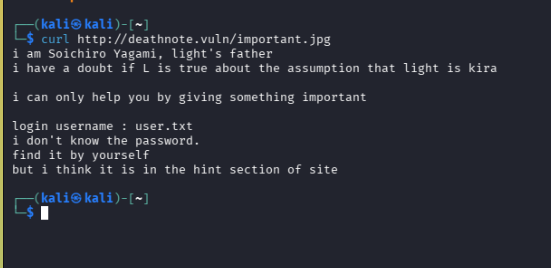

Згадавши про знайдену раніше відкриту директорію завантажень WordPress, ми знаходимо там файл `notes.txt`. Відкривши його, ми отримуємо великий словник потенційних паролів, які, ймовірно, належать цільовому користувачу. 

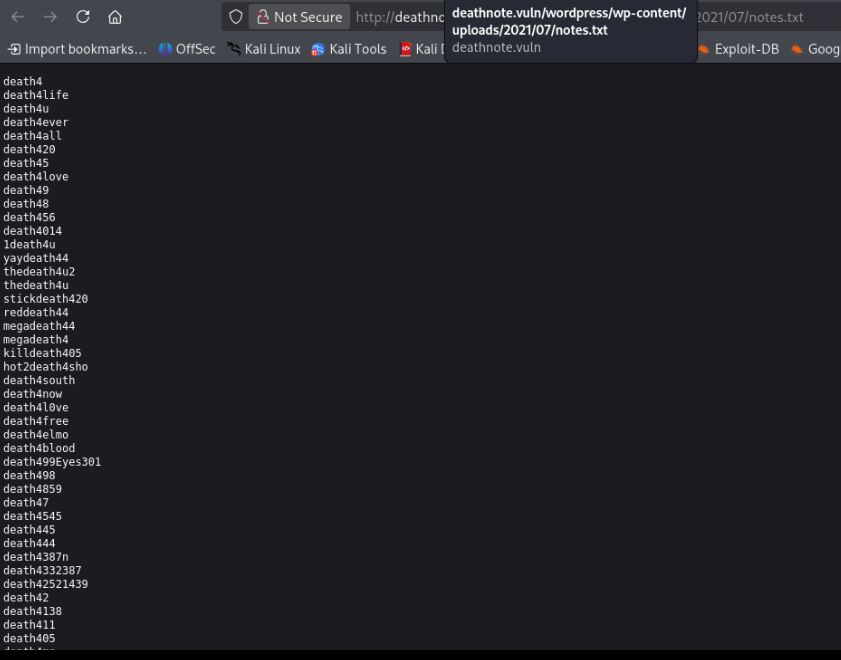

## Етап 2: Отримання початкового доступу

Маючи словник користувачів (`user.txt`) та словник паролів (`notes.txt`), ми переходимо до фази брутфорсу (підбору паролів) для сервісу SSH. Для цього використовується інструмент `hydra`, де параметр `-L` вказує на файл із логінами, а `-P` — на файл із паролями[cite: 1]. Атака проходить успішно і ми отримуємо валідні облікові дані: логін `l` та пароль `death4me`.

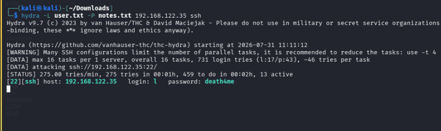

Використовуючи знайдені дані, ми підключаємось до сервера через SSH. Авторизація проходить успішно, і ми отримуємо доступ до командного рядка від імені користувача `l`.

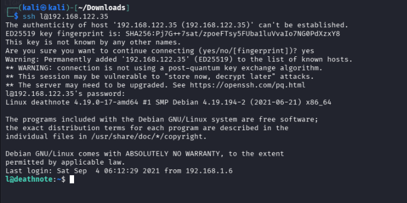

Досліджуючи домашню директорію, ми натрапляємо на зашифрований текст. Проаналізувавши його структуру, стає зрозуміло, що це езотерична мова програмування Brainfuck. Використавши онлайн-декодер, ми розшифровуємо повідомлення: "i think u got the shell , but you wont be able...". Це підтверджує, що ми рухаємось у правильному напрямку.

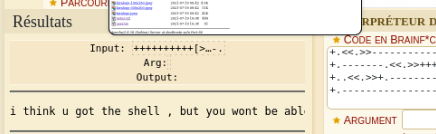

## Етап 3: Підвищення привілеїв

Для подальшого просування системою нам необхідно знайти інформацію, пов'язану з іншими користувачами, зокрема з "kira". Ми використовуємо команду `find / -name 'kira*' 2>/dev/null` для пошуку всіх файлів та директорій у системі, назва яких починається на "kira". Результат пошуку вказує на цікаву директорію `/opt/L/kira-case`.

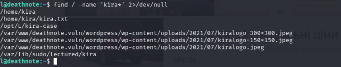

Під час подальшого дослідження знайдених директорій виявляється рядок, закодований у форматі Base64. Використавши інструмент для декодування Base64 у текст, ми отримуємо новий пароль: `passwd : kiraisevil`.

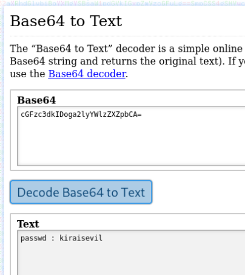

Отримавши пароль, ми читаємо вміст файлу `case.wav` у директорії `fake-notebook-rule`, який містить шістнадцяткові значення. Після цього ми застосовуємо команду `su kira`, яка використовується для зміни користувача в поточній сесії[cite: 1]. Ввівши знайдений пароль `kiraisevil`, ми успішно переходимо на користувача `kira`. Нарешті, ми виконуємо команду `sudo -i`, щоб отримати права суперкористувача (root)[cite: 1]. Перейшовши в директорію `/root`, ми читаємо фінальний файл `root.txt`, який містить переможний ASCII-арт та хеш, що символізує успішне завершення завдання.

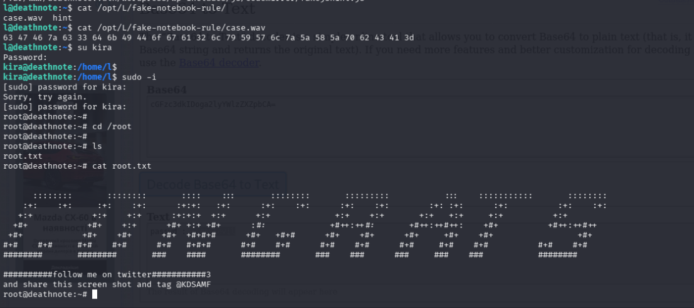

## Висновки

Проходження даної віртуальної машини продемонструвало класичний ланцюжок кібератаки. Початкова розвідка дозволила виявити неправильно налаштований веб-сервер із відкритим лістингом директорій. Уважне вивчення вихідного коду та файлів конфігурації (таких як `robots.txt`) призвело до розкриття конфіденційної інформації (словників паролів). Здобута інформація дозволила здійснити успішну атаку перебором на сервіс SSH для отримання первинного доступу. Підвищення привілеїв вимагало ретельного дослідження локальної файлової системи за допомогою утиліти пошуку та базових навичок криптографії (декодування Brainfuck та Base64). Основна вразливість системи полягала у витоку чутливих даних через веб-сервер та зберіганні паролів інших користувачів у відкритому або слабко зашифрованому вигляді всередині системи.
